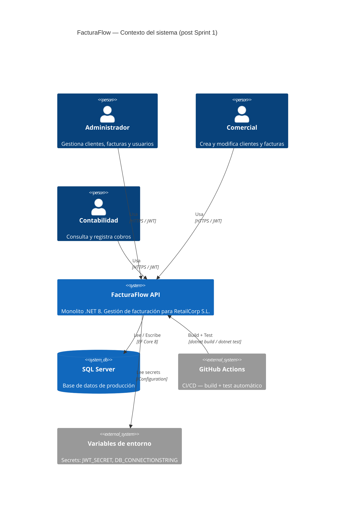
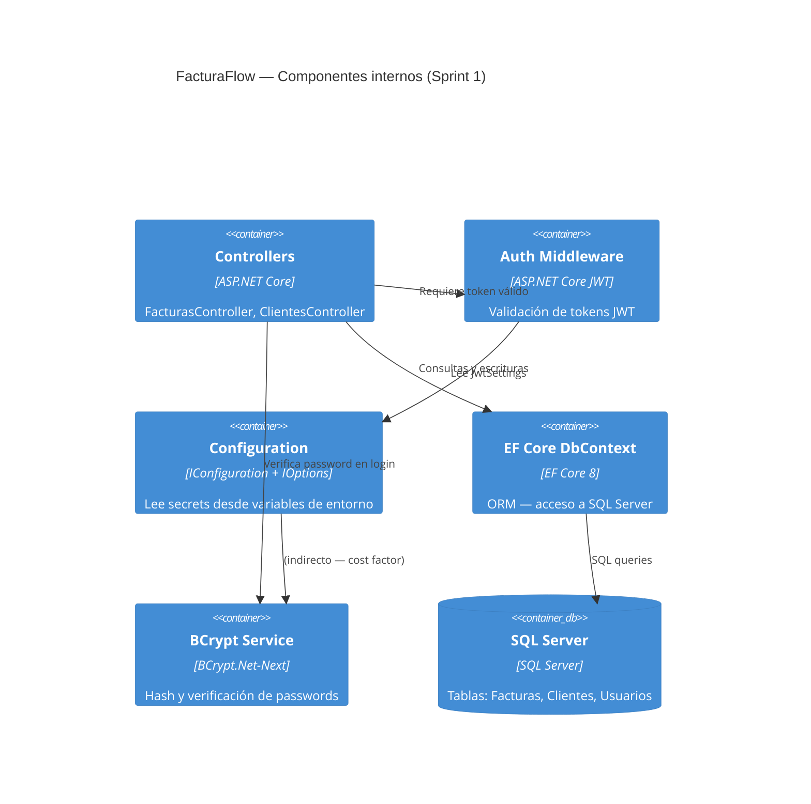
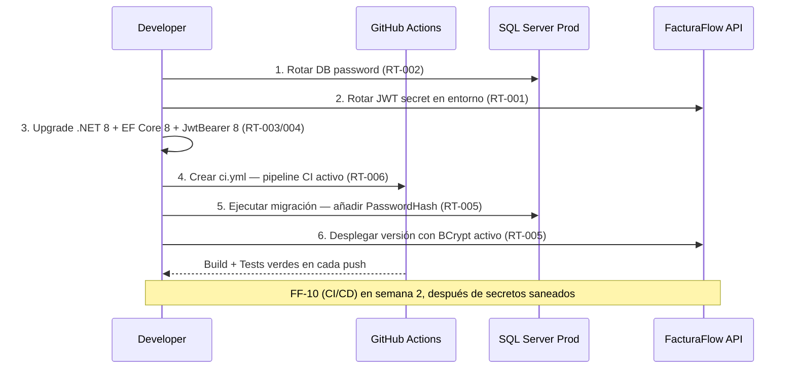

# HLD — Sprint 1 Estabilización · FacturaFlow
**Feature:** STAB-S1 · **Proyecto:** FacturaFlow · **Cliente:** RetailCorp S.L.
**Stack:** .NET 8 / ASP.NET Core / EF Core / SQL Server
**Tipo:** technical-debt · **Sprint:** 1 · **Versión:** 1.0 · **Estado:** DRAFT

---

## 1. Análisis de impacto

Sprint 1 no introduce nuevos servicios ni nuevos endpoints. Todos los cambios
son internos al monolito existente. No hay impacto en contratos de API vigentes.

| Componente | Tipo de impacto | Acción requerida |
|---|---|---|
| `FacturaFlow.Api` (monolito) | Modificación interna | Upgrade runtime + paquetes + configuración |
| Contrato OpenAPI existente | Ninguno | Sin cambios — endpoints no se modifican |
| Base de datos SQL Server | Migración aditiva | Añadir columna `PasswordHash` — compatible hacia adelante |
| Clientes de la API | Ninguno | Transparente para consumidores externos |

**Decisión:** sin impacto en servicios externos. Se continúa con el diseño.

---

## 2. Contexto del sistema — C4 Nivel 1

---

## 3. Componentes internos del monolito — C4 Nivel 2

---

## 4. Servicios nuevos o modificados

| Componente | Acción | Descripción del cambio |
|---|---|---|
| `appsettings.json` | MODIFICADO | Eliminar secrets. Leer desde variables de entorno. |
| `Program.cs` / `Startup.cs` | MODIFICADO | Configurar IOptions con validación obligatoria de env vars. |
| `FacturaFlow.Api.csproj` | MODIFICADO | Upgrade .NET 6 → 8, EF Core 6 → 8, JwtBearer 6 → 8. |
| `Usuarios` (tabla BD) | MIGRACIÓN ADITIVA | Añadir columna `PasswordHash nvarchar(max)`. |
| `AuthController` / lógica login | MODIFICADO | Usar `BCrypt.Verify` en lugar de comparación directa. |
| `.github/workflows/ci.yml` | NUEVO | Pipeline CI: build + test en cada push a main/develop. |

---

## 5. Secuencia de despliegue Sprint 1

---

## 6. Decisiones técnicas — ver ADRs

- **ADR-001:** Estrategia de migración BCrypt — 1 fase vs 2 fases
- **ADR-002:** .NET 8 LTS como target de upgrade
- **ADR-003:** Variables de entorno vs Azure Key Vault para gestión de secrets
