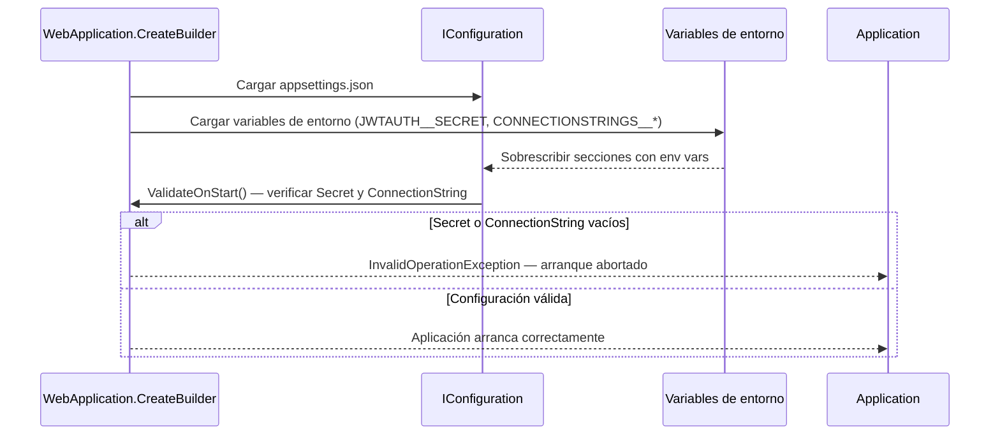
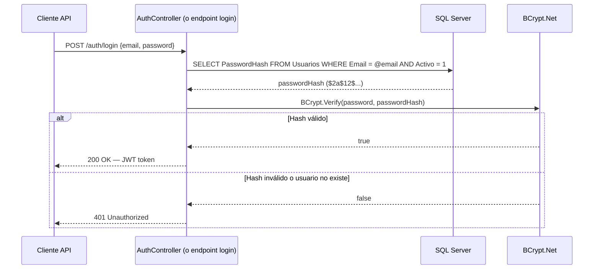

# LLD — Sprint 1 Estabilización · FacturaFlow
**Feature:** STAB-S1 · **Stack:** .NET 8 / ASP.NET Core / EF Core / SQL Server
**Sprint:** 1 · **Versión:** 1.0 · **Estado:** DRAFT

---

## 1. Estructura del monolito (existente — sin cambios estructurales)

```
repo-cliente/
├── FacturaFlow.Api/
│   ├── Controllers/
│   │   ├── FacturasController.cs
│   │   └── ClientesController.cs
│   ├── Models/
│   │   └── Entities.cs          ← MODIFICAR: añadir PasswordHash a Usuario
│   ├── Data/
│   │   └── AppDbContext.cs       ← MODIFICAR: EF Core 8
│   ├── Migrations/               ← NUEVA MIGRACIÓN: AddPasswordHash
│   ├── appsettings.json          ← MODIFICAR: eliminar secrets
│   ├── Program.cs                ← CREAR (no existe en repo heredado): env vars + BCrypt DI + JwtSettings class
│   └── FacturaFlow.Api.csproj    ← MODIFICAR: .NET 8, EF Core 8, JwtBearer 8, Xunit, BCrypt.Net-Next
└── .github/
    └── workflows/
        └── ci.yml                ← NUEVO
```

---

## 2. RT-001 + RT-002 — Gestión de secrets con variables de entorno

### 2.1 Cambios en `appsettings.json`

**Antes (❌ inseguro):**
```json
{
  "JwtSettings": {
    "Secret": "mi-secret-hardcodeado-en-el-repo",
    "Issuer": "FacturaFlow",
    "Audience": "FacturaFlowClients",
    "ExpiryMinutes": 1440
  },
  "ConnectionStrings": {
    "DefaultConnection": "Server=prod-sql;Database=FacturaFlowDB;User=sa;Password=contraseña-hardcodeada;"
  }
}
```

**Después (✅ seguro):**
```json
{
  "JwtSettings": {
    "Issuer": "FacturaFlow",
    "Audience": "FacturaFlowClients",
    "ExpiryMinutes": 1440
  },
  "ConnectionStrings": {
    "DefaultConnection": ""
  }
}
```

### 2.2 Variables de entorno requeridas

| Variable | Contenido | Ejemplo |
|---|---|---|
| `JWTAUTH__SECRET` | JWT signing secret (≥ 256 bits, base64) | `k9mP2xQ7...` (no incluir en código) |
| `CONNECTIONSTRINGS__DEFAULTCONNECTION` | Connection string completa | `Server=prod-sql;Database=FacturaFlowDB;User=sa;Password=NUEVO_PASSWORD;` |

> ASP.NET Core soporta natively la notación `__` para sobrescribir secciones anidadas del `appsettings.json`. No se requiere código adicional — `IConfiguration` lee automáticamente las variables de entorno con ese formato.

### 2.3 Validación al arranque en `Program.cs`

```csharp
// Program.cs — añadir validación obligatoria de secrets al iniciar
builder.Services.AddOptions<JwtSettings>()
    .Bind(builder.Configuration.GetSection("JwtSettings"))
    .Validate(s => !string.IsNullOrWhiteSpace(s.Secret),
              "JWTAUTH__SECRET no está configurado. La aplicación no puede arrancar sin JWT secret.")
    .ValidateOnStart();

// Validar connection string
var connStr = builder.Configuration.GetConnectionString("DefaultConnection");
if (string.IsNullOrWhiteSpace(connStr))
    throw new InvalidOperationException(
        "CONNECTIONSTRINGS__DEFAULTCONNECTION no está configurado. La aplicación no puede arrancar sin conexión a BD.");
```

---

## 3. RT-003 + RT-004 — Upgrade .NET 8 + EF Core 8 + JwtBearer 8

### 3.1 Cambios en `FacturaFlow.Api.csproj`

```xml
<!-- Antes -->
<TargetFramework>net6.0</TargetFramework>
<PackageReference Include="Microsoft.EntityFrameworkCore" Version="6.0.0" />
<PackageReference Include="Microsoft.EntityFrameworkCore.SqlServer" Version="6.0.0" />
<PackageReference Include="Microsoft.EntityFrameworkCore.Tools" Version="6.0.0" />
<PackageReference Include="Microsoft.AspNetCore.Authentication.JwtBearer" Version="6.0.0" />

<!-- Después -->
<TargetFramework>net8.0</TargetFramework>
<PackageReference Include="Microsoft.EntityFrameworkCore" Version="8.0.*" />
<PackageReference Include="Microsoft.EntityFrameworkCore.SqlServer" Version="8.0.*" />
<PackageReference Include="Microsoft.EntityFrameworkCore.Tools" Version="8.0.*" />
<PackageReference Include="Microsoft.AspNetCore.Authentication.JwtBearer" Version="8.0.*" />
<PackageReference Include="BCrypt.Net-Next" Version="4.0.*" />
<!-- INC-003: Xunit no estaba en el .csproj heredado — añadir obligatoriamente para que dotnet test funcione -->
<PackageReference Include="xunit" Version="2.9.*" />
<PackageReference Include="xunit.runner.visualstudio" Version="2.8.*" />
<PackageReference Include="Microsoft.NET.Test.Sdk" Version="17.*" />
```

### 3.2 Breaking changes conocidos EF Core 8 a verificar

| Área | Cambio | Acción |
|---|---|---|
| `DateOnly` / `TimeOnly` | Soporte nativo en EF Core 8 | Revisar si el modelo usa `DateTime` donde debería ser `DateOnly` |
| Bulk operations | API mejorada | Sin impacto — no se usan bulk ops actualmente |
| Lazy loading | Comportamiento actualizado | Sin impacto — no se usa lazy loading |
| Migrations | Compatible hacia atrás | Ejecutar `dotnet ef migrations list` para verificar |
| **AutoMapper 10.1.1** | Compatible con .NET 8 a nivel runtime | Verificar que el build pasa — si falla, actualizar a AutoMapper 12.x |

### 3.3 Diagrama de secuencia — arranque con validación de configuración



---

## 4. RT-005 — Migración BCrypt

### 4.1 Mapa de tipos — tabla `Usuarios` (LA-019-13)

| Columna | Tipo SQL Server | Tipo C# | Notas |
|---|---|---|---|
| `Id` | `int IDENTITY` | `int` | PK autoincremental |
| `Email` | `nvarchar(255) UNIQUE` | `string` | Índice único IX_Usuarios_Email |
| `Password` | `nvarchar(max) NULL` ← MODIFICADO | `string?` | Actualmente `string` en código — cambiar a `string?` en Entities.cs. Vaciado en migración. |
| `PasswordHash` | `nvarchar(max) NULL` ← NUEVO | `string?` | Hash BCrypt cost 12. Formato: `$2a$12$...` |
| `Rol` | `nvarchar(50)` | `string` | Valores exactos en BD: `Admin`, `Comercial`, `Contabilidad`, `Solo_Lectura` |
| `Activo` | `bit` | `bool` | true = activo |

### 4.2 Migración EF Core — `AddPasswordHash`

```csharp
// Migrations/[timestamp]_AddPasswordHash.cs
public partial class AddPasswordHash : Migration
{
    protected override void Up(MigrationBuilder migrationBuilder)
    {
        // Paso 1: añadir columna PasswordHash
        migrationBuilder.AddColumn<string>(
            name: "PasswordHash",
            table: "Usuarios",
            type: "nvarchar(max)",
            nullable: true);

        // Paso 2: hashear passwords existentes con BCrypt cost factor 12
        migrationBuilder.Sql(@"
            -- NOTA: Este SQL no puede llamar a BCrypt directamente.
            -- La migración de DATOS se ejecuta mediante el script de seed
            -- separado: scripts/migrate-passwords-to-bcrypt.cs
            -- Este paso solo prepara la estructura.
            UPDATE Usuarios SET PasswordHash = 'PENDING_MIGRATION' WHERE PasswordHash IS NULL;
        ");
    }

    protected override void Down(MigrationBuilder migrationBuilder)
    {
        migrationBuilder.DropColumn(name: "PasswordHash", table: "Usuarios");
    }
}
```

> ⚠️ **La migración de datos (hashear passwords) NO puede hacerse en SQL puro** porque BCrypt requiere .NET. Se ejecuta mediante un script de utilidad separado (`scripts/MigratePasswordsToBcrypt.cs`) que se ejecuta una única vez tras desplegar la migración estructural.

### 4.3 Script de migración de datos — `MigratePasswordsToBcrypt.cs`

```csharp
// scripts/MigratePasswordsToBcrypt.cs — script de utilidad one-shot
// Ejecutar: dotnet run --project scripts/MigratePasswordsToBcrypt.csproj

using BCrypt.Net;
using Microsoft.EntityFrameworkCore;

var users = await db.Usuarios
    .Where(u => u.Password != null && u.PasswordHash == "PENDING_MIGRATION")
    .ToListAsync();

foreach (var user in users)
{
    user.PasswordHash = BCrypt.HashPassword(user.Password, workFactor: 12);
    user.Password = null; // Vaciar texto plano
}

await db.SaveChangesAsync();
Console.WriteLine($"Migrados {users.Count} usuarios a BCrypt.");
```

### 4.4 Cambios en la entidad `Usuario`

```csharp
// Models/Entities.cs
public class Usuario
{
    public int Id { get; set; }
    public string Email { get; set; } = null!;
    public string? Password { get; set; }     // Deprecated — vaciar en migración
    public string? PasswordHash { get; set; } // Nuevo — BCrypt hash
    public string Rol { get; set; } = null!;
    public bool Activo { get; set; }
}
```

### 4.5 Diagrama de secuencia — autenticación post-migración



### 4.6 Estrategia de rollback

Si la migración falla:
1. La columna `Password` se mantuvo (nullable) — los usuarios pueden seguir autenticándose con el sistema anterior
2. Hacer rollback de la migración EF Core: `dotnet ef database update [migration-anterior]`
3. La columna `PasswordHash` se elimina
4. El sistema vuelve al estado previo sin pérdida de datos

> La decisión de mantener `Password` durante la migración en lugar de eliminarla en el mismo paso es intencionada — ver ADR-001.

---

## 5. RT-006 — GitHub Actions CI

### 5.1 Workflow `ci.yml`

```yaml
# .github/workflows/ci.yml
name: CI — FacturaFlow

on:
  push:
    branches: [ main, develop ]
  pull_request:
    branches: [ main, develop ]

jobs:
  build:
    name: Build
    runs-on: ubuntu-latest
    steps:
      - uses: actions/checkout@v4
      - name: Setup .NET 8
        uses: actions/setup-dotnet@v4
        with:
          dotnet-version: '8.0.x'
      - name: Restore dependencies
        run: dotnet restore
      - name: Build
        run: dotnet build --no-restore --configuration Release

  test:
    name: Test
    needs: build
    runs-on: ubuntu-latest
    steps:
      - uses: actions/checkout@v4
      - name: Setup .NET 8
        uses: actions/setup-dotnet@v4
        with:
          dotnet-version: '8.0.x'
      - name: Restore dependencies
        run: dotnet restore
      - name: Run tests
        run: dotnet test --no-restore --verbosity normal
        env:
          JWTAUTH__SECRET: ${{ secrets.JWTAUTH_SECRET_TEST }}
          CONNECTIONSTRINGS__DEFAULTCONNECTION: ${{ secrets.DB_CONNECTIONSTRING_TEST }}
```

> Los secrets de test se configuran en GitHub → Settings → Secrets and variables → Actions.

---

## 6. RT-007 — Gobernanza SOFIA (no es cambio de código)

Acciones de configuración sin impacto en el código fuente:

| Acción | Herramienta | Responsable |
|---|---|---|
| Añadir columnas Scrumban al board Jira | Jira board settings | Angel (SM) |
| Configurar WIP limits | Jira board settings | Angel (SM) |
| Crear estructura Confluence | Confluence | Angel (PM) |
| Crear rama `develop` desde `main` | Git | Developer |
| Configurar branch protection en `main` | GitHub repo settings | Angel (TL) |
| Publicar Project Plan en Confluence | Confluence | Angel (PM) |
| Publicar Risk Register en Confluence | Confluence | Angel (PM) |

---

## 6b. Modelo de datos — diagrama ER

```mermaid
erDiagram
  USUARIOS {
    int Id PK
    nvarchar_255 Email UK "NOT NULL"
    nvarchar_max Password NULL "Deprecated — vaciado en migracion Sprint 1"
    nvarchar_max PasswordHash NULL "NUEVO — BCrypt cost 12"
    nvarchar_50 Rol "Admin|Comercial|Contabilidad|Solo_Lectura"
    bit Activo
  }
  CLIENTES {
    int Id PK
    nvarchar_200 RazonSocial "NOT NULL"
    nvarchar_20 NifCif UK "NOT NULL"
    nvarchar_255 Email
    nvarchar_50 Telefono
    nvarchar_500 Direccion
    bit Activo
    datetime2 FechaAlta
    nvarchar_50 TipoCliente "NACIONAL|EUROPEO|EXTRACOMUNITARIO"
  }
  FACTURAS {
    int Id PK
    nvarchar_20 Numero "NOT NULL"
    int ClienteId FK
    datetime2 FechaCreacion
    datetime2 FechaEmision NULL
    datetime2 FechaVencimiento NULL
    nvarchar_20 Estado "BORRADOR|EMITIDA|PAGADA|ANULADA"
    decimal_18_2 BaseImponible
    decimal_5_2 PorcentajeIVA
    decimal_18_2 Total
  }
  CLIENTES ||--o{ FACTURAS : "tiene"
```

> Sprint 1 solo modifica la tabla USUARIOS — migracion aditiva. CLIENTES y FACTURAS no se modifican.

---

## 6c. Contrato OpenAPI — Sprint 1

> Este sprint **no modifica ni añade endpoints**. El contrato OpenAPI existente permanece inalterado.
> Verificado en HLD sección 1: "Contrato OpenAPI existente — Ninguno — Sin cambios."
>
> Los cambios de seguridad (secrets, BCrypt, upgrade de paquetes) son transparentes para los consumidores de la API.
> No se requiere versionado de endpoints.

---

## 7. RTM actualizada — columna Componente Arq.

| ID RT | Jira | Componente Arq. | Fichero/s afectados |
|---|---|---|---|
| RT-001 | FF-5 | `appsettings.json` · `Program.cs` · `JwtSettings.cs` | Configuración JWT |
| RT-002 | FF-6 | `appsettings.json` · `Program.cs` | Connection string |
| RT-003 | FF-7 | `FacturaFlow.Api.csproj` · `AppDbContext.cs` · `Migrations/` | EF Core 8 |
| RT-004 | FF-8 | `FacturaFlow.Api.csproj` · `Program.cs` (AddAuthentication) | JwtBearer 8 |
| RT-005 | FF-9 | `Entities.cs` · `Migrations/[ts]_AddPasswordHash.cs` · `scripts/MigratePasswordsToBcrypt.cs` | BCrypt |
| RT-006 | FF-10 | `.github/workflows/ci.yml` | GitHub Actions |
| RT-007 | FF-22 | Jira · Confluence · GitHub (branch protection) | Gobernanza |

---

## 8. Variables de entorno — resumen completo Sprint 1

| Variable | RT | Obligatoria | Descripción |
|---|---|---|---|
| `JWTAUTH__SECRET` | RT-001 | Sí | JWT signing secret ≥ 256 bits |
| `CONNECTIONSTRINGS__DEFAULTCONNECTION` | RT-002 | Sí | Connection string SQL Server |
| `JWTAUTH__SECRET_TEST` | RT-006 | Sí (GitHub Secret) | JWT secret para CI |
| `DB_CONNECTIONSTRING_TEST` | RT-006 | Sí (GitHub Secret) | BD de test para CI |
